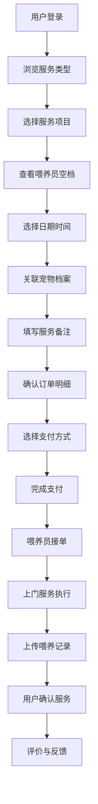

## 1. 产品概述

宠物喂养服务平台是一款连接宠物主人与专业喂养员的 O2O 服务应用，解决上班族、出差人群因工作繁忙或外出无法照料宠物的痛点。平台提供标准化上门喂养服务，涵盖喂食、换水、清理、遛宠等全方位照料，保障宠物健康与安全。

- 核心价值：让宠物主人安心工作出行，让宠物得到专业照料，为社区空闲人员提供灵活就业机会
- 目标用户：上班族、出差用户、社区喂养员、平台运营管理员

## 2. 核心功能

### 2.1 用户角色

| 角色 | 注册方式 | 核心权限 |
|------|----------|----------|
| 宠物主人 | 手机号注册 | 登记宠物档案、预约服务、在线支付、查看记录、评价售后 |
| 喂养员 | 资质审核注册 | 接单抢单、确认到达、上传凭证、记录喂养情况、查看收入 |
| 平台管理员 | 后台账号登录 | 人员审核、价格配置、订单管理、退款处理、投诉查看、数据导出 |

### 2.2 功能模块

1. **首页概览**：服务入口展示、热门推荐、喂养员风采、用户评价、快捷预约
2. **宠物档案**：宠物信息管理、品种年龄、忌口药品、联系人、门禁密码
3. **喂养计划**：按日期创建喂养计划、周期性设置、服务内容组合
4. **服务预约**：选择服务类型、查看喂养员资质与空档、提交备注、预约确认
5. **订单支付**：订单详情、价格明细、优惠券、在线支付、支付凭证
6. **喂养记录**：喂养员上传照片视频、食量饮水记录、排便用药标记、异常上报
7. **消息通知**：系统通知、订单状态、喂养提醒、评价提醒、消息中心
8. **评价售后**：星级评价、文字评价、图片上传、售后申请、退款处理、投诉反馈

### 2.3 页面详情

| 页面名称 | 模块名称 | 功能描述 |
|----------|----------|----------|
| 首页概览 | 导航栏 | 顶部品牌标识、功能入口导航、用户中心入口 |
| 首页概览 | Hero 区域 | 主视觉展示、服务标语、快捷预约按钮 |
| 首页概览 | 服务分类 | 喂食、换水、清理、遛宠、拍照、异常上报六类服务卡片 |
| 首页概览 | 喂养员风采 | 优质喂养员展示、资质标签、服务评分、接单状态 |
| 首页概览 | 用户评价 | 真实用户评价轮播、星级展示、宠物照片 |
| 首页概览 | 数据统计 | 服务订单数、好评率、喂养员数量、覆盖城市 |
| 宠物档案 | 档案列表 | 宠物卡片展示、品种头像、基本信息、编辑入口 |
| 宠物档案 | 档案表单 | 宠物姓名、品种、年龄、性别、体重、照片上传 |
| 宠物档案 | 健康信息 | 疫苗记录、忌口食物、服用药品、过敏史 |
| 宠物档案 | 联系人信息 | 紧急联系人、备用钥匙、门禁密码、特殊说明 |
| 喂养计划 | 计划列表 | 按日期展示喂养计划、状态标签、服务内容概览 |
| 喂养计划 | 创建计划 | 日期选择器、服务类型多选、时间设置、关联宠物 |
| 喂养计划 | 周期设置 | 按日/周/月重复、结束日期、例外日期排除 |
| 服务预约 | 服务选择 | 服务类型卡片、价格展示、服务时长、详细说明 |
| 服务预约 | 喂养员选择 | 喂养员列表、资质标签、空档日历、评分展示 |
| 服务预约 | 预约确认 | 服务时间、宠物选择、备注填写、价格明细 |
| 订单支付 | 订单详情 | 服务项目、喂养员信息、预约时间、服务地址 |
| 订单支付 | 价格明细 | 服务费用、优惠券抵扣、实付金额 |
| 订单支付 | 支付方式 | 微信支付、支付宝、银行卡、支付状态确认 |
| 喂养记录 | 记录列表 | 按订单展示喂养记录、时间线、完成状态 |
| 喂养记录 | 详情展示 | 照片视频轮播、食量饮水记录、排便情况、用药标记 |
| 喂养记录 | 异常上报 | 异常类型选择、照片证据、详细描述、处理状态 |
| 消息通知 | 消息分类 | 系统通知、订单通知、喂养提醒、评价提醒 |
| 消息通知 | 消息列表 | 消息标题、时间、已读状态、详情入口 |
| 评价售后 | 评价表单 | 星级评分、服务态度、专业程度、准时程度 |
| 评价售后 | 评价内容 | 文字评价、照片上传、匿名评价选项 |
| 评价售后 | 售后管理 | 退款申请、原因说明、进度跟踪、投诉反馈 |

## 3. 核心流程

### 3.1 宠物主人预约服务流程

用户登录首页 → 浏览服务类型 → 选择所需服务 → 查看可用喂养员 → 选择日期时间 → 选择宠物档案 → 填写备注要求 → 确认订单详情 → 选择支付方式 → 完成支付 → 等待喂养员接单 → 接收喂养记录 → 服务完成后评价

### 3.2 喂养员接单服务流程

喂养员登录 → 查看可接订单 → 抢单/接单 → 联系用户确认 → 按时到达 → 执行喂养服务 → 拍照记录 → 填写喂养详情 → 标记完成 → 等待用户确认 → 查看服务评价 → 结算收入

### 3.3 管理员运营流程

管理员登录 → 喂养员资质审核 → 服务价格配置 → 订单监控 → 退款处理 → 投诉查看 → 数据对账导出 → 平台运营管理

## 4. 用户界面设计

### 4.1 设计风格

**设计理念**：温暖治愈、专业可靠、清新自然

- **主色调**：暖橙色 (#FF8A3D) - 代表温暖、活力、关怀
- **辅助色**：薄荷绿 (#4ECDC4) - 代表清新、健康、安心
- **中性色**：奶白色 (#FFF9F0)、暖灰色 (#F5EFE6)、深棕色 (#4A3728)
- **按钮风格**：圆角矩形按钮、渐变填充、柔和阴影、悬停微动画
- **字体**：标题使用圆润可爱的 display 字体，正文使用清晰易读的无衬线字体
- **布局风格**：卡片式布局、柔和圆角、充足留白、温馨插画点缀
- **图标风格**：线性填充结合、圆角设计、宠物元素、暖色调

### 4.2 页面设计概述

| 页面名称 | 模块名称 | UI 元素 |
|----------|----------|----------|
| 首页概览 | Hero 区域 | 暖橙色渐变背景、宠物插画、大标题、渐入动画 |
| 首页概览 | 服务分类 | 六边形卡片、图标动画、悬停上浮效果 |
| 首页概览 | 喂养员展示 | 圆形头像、资质徽章、评分星星、横向滚动 |
| 宠物档案 | 档案卡片 | 宠物头像、信息标签、编辑按钮、滑动删除 |
| 服务预约 | 日期选择 | 日历组件、可选日期高亮、已选标记、平滑过渡 |
| 服务预约 | 喂养员列表 | 卡片式布局、空档日历预览、一键选择 |
| 订单支付 | 价格明细 | 折叠面板、价格动画、优惠券弹窗 |
| 喂养记录 | 照片墙 | 瀑布流布局、照片放大预览、时间线标记 |
| 消息通知 | 消息列表 | 分类标签、未读红点、左滑删除 |
| 评价售后 | 星级评分 | 点击星星动画、表情反馈、标签选择 |

### 4.3 响应式设计

- **桌面端优先**：1200px 以上宽屏展示，三栏布局
- **平板适配**：768px - 1199px，两栏布局，导航折叠
- **手机适配**：768px 以下，单栏布局，底部 Tab 导航，触控优化
- **触控优化**：按钮最小 44x44px，手势操作，下拉刷新

### 4.4 动效设计

- 页面加载：元素渐入、交错动画
- 卡片交互：悬停上浮、阴影加深、微缩放
- 按钮点击：缩放反馈、波纹效果
- 状态切换：淡入淡出、滑动过渡
- 数据加载：骨架屏、旋转加载动画
