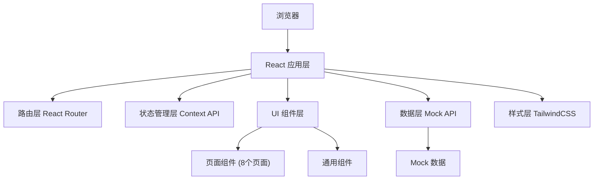
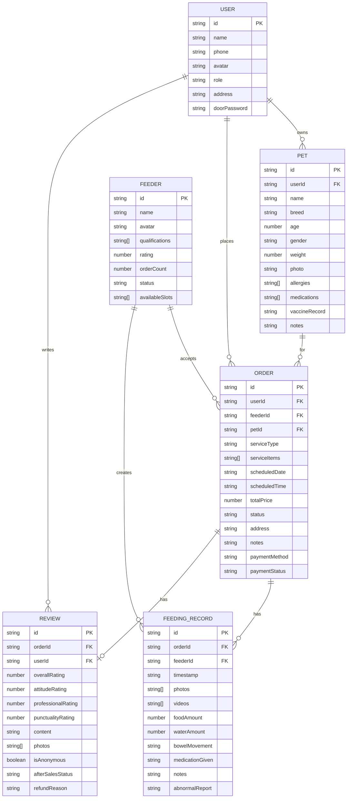

## 1. 架构设计

本项目为纯前端应用，采用 React 单页应用架构，所有数据使用 Mock 数据模拟，不依赖后端服务。



## 2. 技术描述

- **前端框架**：React@18 + TypeScript
- **构建工具**：Vite@5
- **样式方案**：TailwindCSS@3
- **路由管理**：React Router DOM@6
- **状态管理**：React Context API
- **图标库**：Lucide React
- **日期处理**：date-fns
- **数据源**：本地 Mock 数据 + LocalStorage 持久化
- **UI 动效**：Framer Motion

## 3. 目录结构

```
src/
├── assets/              # 静态资源（图片、图标）
├── components/          # 通用组件
│   ├── Layout/         # 布局组件（Header、Footer、Sidebar）
│   ├── ui/             # 基础 UI 组件（Button、Card、Input 等）
│   └── features/       # 业务组件
├── pages/              # 页面组件（8个页面）
│   ├── Home/           # 首页概览
│   ├── PetProfile/     # 宠物档案
│   ├── FeedingPlan/    # 喂养计划
│   ├── ServiceBooking/ # 服务预约
│   ├── OrderPayment/   # 订单支付
│   ├── FeedingRecord/  # 喂养记录
│   ├── Notification/   # 消息通知
│   └── ReviewAftersales/ # 评价售后
├── context/            # 全局状态
│   ├── AuthContext.tsx
│   ├── OrderContext.tsx
│   └── PetContext.tsx
├── data/               # Mock 数据
│   ├── mockData.ts
│   └── types.ts        # TypeScript 类型定义
├── hooks/              # 自定义 Hooks
├── utils/              # 工具函数
├── App.tsx             # 应用入口
├── main.tsx            # 渲染入口
└── index.css           # 全局样式
```

## 4. 路由定义

| 路由路径 | 页面名称 | 说明 |
|----------|----------|------|
| / | 首页概览 | 服务入口、热门推荐、喂养员展示 |
| /pets | 宠物档案 | 宠物列表、新增/编辑宠物档案 |
| /plans | 喂养计划 | 喂养计划列表、创建计划 |
| /booking | 服务预约 | 选择服务、喂养员、预约时间 |
| /booking/feeder | 喂养员选择 | 喂养员列表、空档日历 |
| /order/:id | 订单支付 | 订单详情、价格明细、支付 |
| /records | 喂养记录 | 喂养记录列表、详情查看 |
| /notifications | 消息通知 | 消息分类、消息列表 |
| /reviews | 评价售后 | 评价表单、售后管理 |

## 5. 数据模型

### 5.1 ER 图



### 5.2 TypeScript 类型定义

```typescript
// 用户类型
interface User {
  id: string;
  name: string;
  phone: string;
  avatar: string;
  role: 'owner' | 'feeder' | 'admin';
  address: string;
  doorPassword: string;
}

// 宠物类型
interface Pet {
  id: string;
  userId: string;
  name: string;
  breed: string;
  age: number;
  gender: 'male' | 'female';
  weight: number;
  photo: string;
  allergies: string[];
  medications: string[];
  vaccineRecord: string;
  notes: string;
}

// 喂养员类型
interface Feeder {
  id: string;
  name: string;
  avatar: string;
  qualifications: string[];
  rating: number;
  orderCount: number;
  status: 'available' | 'busy' | 'offline';
  availableSlots: string[];
}

// 订单类型
interface Order {
  id: string;
  userId: string;
  feederId: string;
  petId: string;
  serviceType: 'feeding' | 'walking' | 'cleaning' | 'comprehensive';
  serviceItems: string[];
  scheduledDate: string;
  scheduledTime: string;
  totalPrice: number;
  status: 'pending' | 'accepted' | 'in_progress' | 'completed' | 'cancelled' | 'refunded';
  address: string;
  notes: string;
  paymentMethod: 'wechat' | 'alipay' | 'card';
  paymentStatus: 'unpaid' | 'paid' | 'refunded';
}

// 喂养记录类型
interface FeedingRecord {
  id: string;
  orderId: string;
  feederId: string;
  timestamp: string;
  photos: string[];
  videos: string[];
  foodAmount: number;
  waterAmount: number;
  bowelMovement: 'normal' | 'abnormal' | 'none';
  medicationGiven: boolean;
  notes: string;
  abnormalReport?: string;
}

// 评价类型
interface Review {
  id: string;
  orderId: string;
  userId: string;
  overallRating: number;
  attitudeRating: number;
  professionalRating: number;
  punctualityRating: number;
  content: string;
  photos: string[];
  isAnonymous: boolean;
  afterSalesStatus: 'none' | 'pending' | 'processing' | 'resolved' | 'rejected';
  refundReason?: string;
}

// 消息类型
interface Notification {
  id: string;
  userId: string;
  type: 'system' | 'order' | 'feeding' | 'review';
  title: string;
  content: string;
  read: boolean;
  timestamp: string;
  relatedId?: string;
}
```

## 6. 页面组件规划

### 6.1 首页概览 (Home)
- HeroSection：主视觉区域
- ServiceGrid：服务分类网格
- FeederShowcase：喂养员展示区
- Testimonials：用户评价轮播
- StatsPanel：数据统计面板

### 6.2 宠物档案 (PetProfile)
- PetList：宠物卡片列表
- PetForm：宠物信息表单
- HealthInfo：健康信息模块
- ContactInfo：联系人信息模块

### 6.3 喂养计划 (FeedingPlan)
- PlanCalendar：日历视图
- PlanList：计划列表
- PlanForm：创建计划表单
- RecurrenceSettings：周期设置

### 6.4 服务预约 (ServiceBooking)
- ServiceSelector：服务类型选择
- FeederList：喂养员列表
- DatePicker：日期时间选择
- BookingConfirm：预约确认

### 6.5 订单支付 (OrderPayment)
- OrderSummary：订单摘要
- PriceBreakdown：价格明细
- PaymentMethods：支付方式选择
- CouponSelector：优惠券选择

### 6.6 喂养记录 (FeedingRecord)
- RecordTimeline：记录时间线
- PhotoGallery：照片墙
- RecordDetail：记录详情
- AbnormalReport：异常上报

### 6.7 消息通知 (Notification)
- MessageTabs：消息分类标签
- MessageList：消息列表
- MessageDetail：消息详情

### 6.8 评价售后 (ReviewAftersales)
- StarRating：星级评分
- ReviewForm：评价表单
- AfterSalesList：售后列表
- RefundModal：退款申请弹窗

## 7. 全局状态设计

### AuthContext
- currentUser: User | null
- login(): void
- logout(): void
- switchRole(role): void

### PetContext
- pets: Pet[]
- selectedPet: Pet | null
- addPet(pet): void
- updatePet(id, pet): void
- deletePet(id): void

### OrderContext
- orders: Order[]
- currentOrder: Order | null
- createOrder(order): void
- updateOrderStatus(id, status): void
- payOrder(id, method): void

## 8. Mock 数据规划

- 模拟 5 个宠物主人用户
- 模拟 8 个喂养员用户
- 模拟 10 个宠物档案
- 模拟 15 个历史订单
- 模拟 20 条喂养记录
- 模拟 10 条评价数据
- 模拟 25 条消息通知

## 9. 样式与设计系统

### TailwindCSS 主题配置

```javascript
theme: {
  extend: {
    colors: {
      primary: {
        50: '#FFF7ED',
        100: '#FFEDD8',
        200: '#FFD9B0',
        300: '#FFC080',
        400: '#FFA352',
        500: '#FF8A3D',
        600: '#F57026',
        700: '#D95A18',
      },
      secondary: {
        50: '#F0FDFA',
        100: '#CCFBF1',
        200: '#99F6E4',
        300: '#5EEAD4',
        400: '#2DD4BF',
        500: '#4ECDC4',
        600: '#0D9488',
      },
      neutral: {
        50: '#FFF9F0',
        100: '#F5EFE6',
        200: '#E8DFD0',
        700: '#4A3728',
        800: '#3D2D21',
        900: '#2A1E16',
      }
    },
    fontFamily: {
      display: ['"ZCOOL KuaiLe"', 'cursive'],
      body: ['"Noto Sans SC"', 'sans-serif'],
    },
    animation: {
      'float': 'float 3s ease-in-out infinite',
      'pulse-slow': 'pulse 3s cubic-bezier(0.4, 0, 0.6, 1) infinite',
    }
  }
}
```
